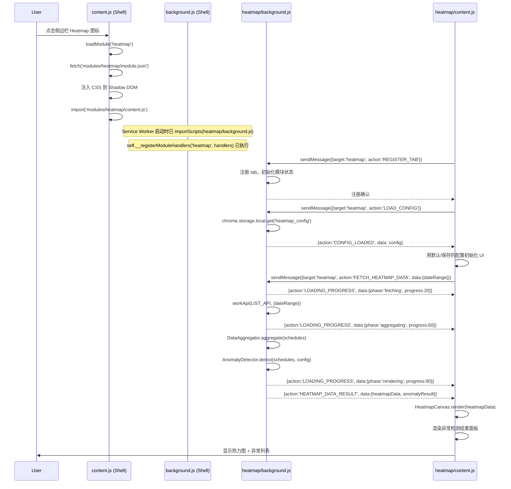
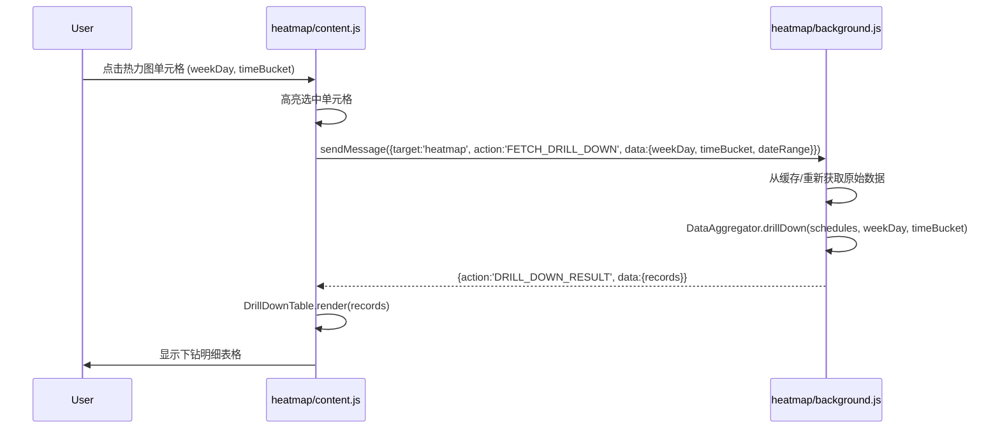
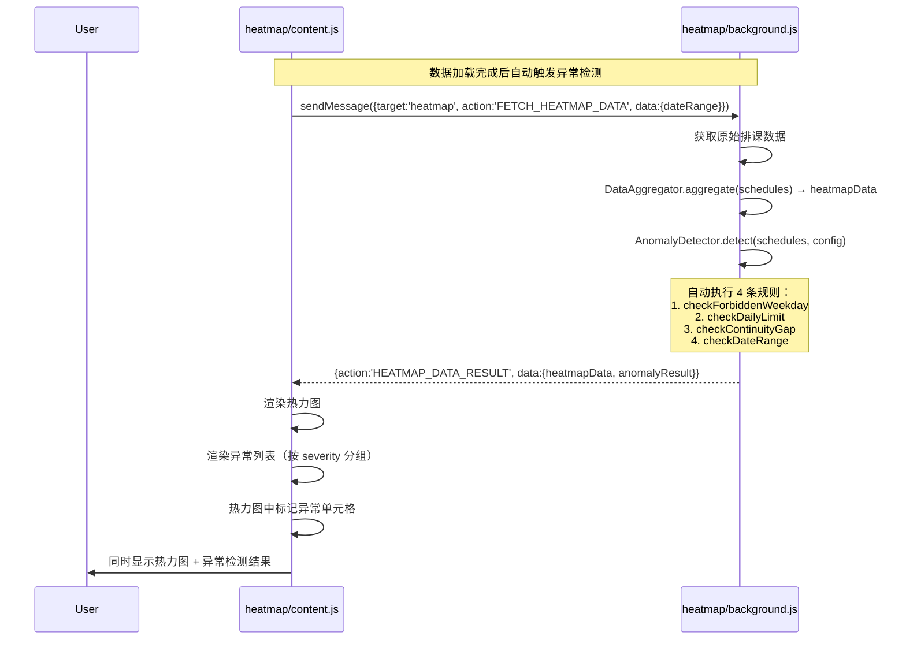
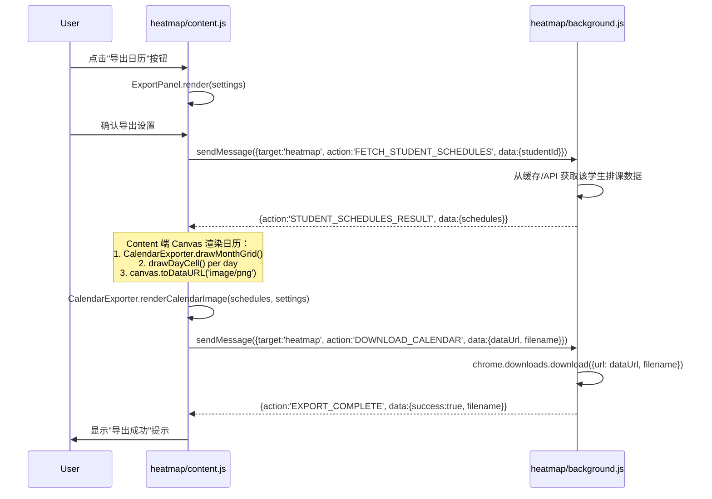

# 课程排期分析看板（Heatmap）— 系统架构设计

> 架构师：高见远（Gao）  
> 版本：v1.1  
> 日期：2026-06-06（修订 2026-06-06 22:41）  
> 基于：`docs/heatmap-prd.md` v1.0
>
> **v1.1 修订**：修复 11 个问题（P0×4 + P1×4 + P2×3），详见文末变更记录

---

## 1. 实现方案与框架选型

### 1.1 整体架构：Hub-and-Spoke 微内核 + 模块隔离

Heatmap 模块遵循现有 Chrome 扩展的 **Hub-and-Spoke 微内核架构**：

- **壳（Shell）**：`background.js`（ModuleRegistry + MessageBus）、`content.js`（侧边栏框架 + 模块加载器）
- **模块（Module）**：`modules/heatmap/` 作为独立模块，通过标准接口注册、加载、通信

模块间通信统一走 **MessageBus**，消息格式 `{ target, action, data }`。

### 1.2 技术选型

| 层面 | 选型 | 理由 |
|------|------|------|
| 扩展架构 | Chrome MV3 + Service Worker | 现有架构已确定，MV3 是 Chrome 扩展强制标准 |
| 模块隔离 | Shadow DOM | 现有模式，CSS/JS 完全隔离，避免样式冲突 |
| 模块通信 | MessageBus (`chrome.runtime.sendMessage`) | 现有模式，壳路由，模块解耦 |
| UI 渲染 | 原生 DOM API + CSS Grid/Flexbox | 无框架依赖，与现有模块一致；侧边栏 420px 限制下无需虚拟 DOM |
| 热力图渲染 | Canvas API | 可实现渐变色 + 点击检测；备选方案 CSS Grid（更轻量，交互更自然）。Canvas 选择主要考虑颜色插值精度和未来扩展性 |
| 日历图片渲染 | Canvas API | 同上，学生日历导出需要图片生成 |
| 数据获取 | `workApi()` + `fetch()` | 复用 report 模块的认证与请求模式，Background 发起，Content 消费 |
| 图表（下钻表格内） | 纯 DOM 表格 | PRD 中下钻表格为简单列表，无需图表库 |
| 数据计算 | Background Service Worker | 大量聚合计算（GROUP BY + COUNT）放在后台，不阻塞 UI |
| 文件下载 | `chrome.downloads.download` | 现有权限已声明，支持静默下载 |

### 1.3 模块边界

```
┌─────────────────────────────────────────────────┐
│                   Shell (壳)                     │
│  background.js          content.js               │
│  ├─ ModuleRegistry      ├─ Sidebar (420px)       │
│  └─ MessageBus          └─ ModuleLoader          │
├─────────────────────────────────────────────────┤
│              Heatmap Module                      │
│                                                  │
│  background.js        content.js                 │
│  ├─ workApi()         ├─ Shadow DOM UI           │
│  ├─ DataAggregator    ├─ HeatmapCanvas           │
│  └─ AnomalyDetector   ├─ DrillDownTable          │
│                       ├─ CalendarExporter        │
│                       ├─ ExportPanel             │
│                       └─ SettingsPanel            │
└─────────────────────────────────────────────────┘
```

**关键原则**：
- Background 负责所有 API 调用、数据聚合计算和异常检测
- Content 负责 UI 渲染（含 Canvas 日历图片生成）和用户交互
- **CalendarExporter（Canvas 渲染）在 content.js 中执行**（SW 无 DOM/Canvas）
- 模块间通过 MessageBus 通信，禁止直接调用

---

## 2. 文件清单与路径

```
plugins/toolbox/
├── manifest.json                          # [修改] 新增 heatmap 模块资源声明
├── background.js                          # [修改] KNOWN_MODULES 新增 'heatmap'
├── content.js                             # [修改] CONFIG.knownModules 新增 'heatmap'，ICON_MAP 新增图标
├── modules/
│   └── heatmap/
│       ├── module.json                    # [新增] 模块元数据描述
│       ├── background.js                  # [新增] 模块后台脚本
│       ├── content.js                     # [新增] 模块内容脚本（UI 渲染 + 交互）
│       └── content.css                    # [新增] 模块样式
└── docs/
    └── heatmap-architecture.md            # [本文档]
```

### 2.1 各文件职责

| 文件 | 职责 |
|------|------|
| `modules/heatmap/module.json` | 模块元数据：名称、版本、入口文件声明、权限需求 |
| `modules/heatmap/background.js` | API 数据获取、数据聚合（热力图数据 + 下钻数据）、异常检测算法、配置持久化、文件下载代理 |
| `modules/heatmap/content.js` | Shadow DOM 内 UI 构建、热力图 Canvas 渲染、下钻表格渲染、导出设置面板、用户交互处理 |
| `modules/heatmap/content.css` | 模块内样式（Grid 布局、热力图 cell、表格、面板、动画） |

### 2.2 壳文件修改点

**`manifest.json`** — `web_accessible_resources` 新增：
```json
{
  "resources": [
    "modules/heatmap/module.json",
    "modules/heatmap/content.js",
    "modules/heatmap/content.css"
  ],
  "matches": ["<all_urls>"]
}
```

**`background.js`** — 修改：
```javascript
KNOWN_MODULES = ['report', 'dingtalk', 'tiaoke', 'updater', 'heatmap']
KNOWN_MODULE_BG_MAP['heatmap'] = 'modules/heatmap/background.js'
```

**`content.js`** — 修改：
```javascript
CONFIG.knownModules = ['report', 'dingtalk', 'tiaoke', 'updater', 'heatmap']
ICON_MAP['heatmap'] = '🔥'  // 或使用 SVG 图标
```

---

## 3. 数据结构与接口（类图）

### 3.1 核心数据结构

```typescript
// ===== API 原始数据 =====

/** 单条排课记录（来自 /next/class/list） */
interface ScheduleRecord {
  studentId: string;
  studentName: string;
  courseId: string;
  courseName: string;
  classDate: string;       // 'YYYY-MM-DD'
  startTime: string;       // 'HH:mm'
  endTime: string;         // 'HH:mm'
  teacherId: string;
  teacherName: string;
  status: number;          // 排课状态
  weekDay: number;         // 0-6, 0=周日
}

/** AI 业务数据（来自 /ai/teacher/ai/biz） */
interface BizData {
  studentId: string;
  studentName: string;
  grade: string;
  subject: string;
  // ... 其他业务字段
}

// ===== 聚合数据 =====

/** 时间桶：每 30 分钟一个 */
interface TimeBucket {
  label: string;           // '08:00-08:30'
  startMinutes: number;    // 480 (从午夜起分钟数)
  endMinutes: number;      // 510
}

/** 热力图单元格数据 */
interface HeatmapCell {
  weekDay: number;         // 0-6
  timeBucket: string;      // '08:00-08:30'
  studentCount: number;    // 该时段的学生数
  scheduleCount: number;   // 该时段的排课条数
  density: number;         // 0-1 密度值（用于颜色映射）
  isAllowed: boolean;      // 是否为允许排课的星期
}

/** 热力图完整数据 */
interface HeatmapData {
  cells: HeatmapCell[];
  timeBuckets: TimeBucket[];
  weekDays: number[];      // 参与计算的星期列表
  maxDensity: number;      // 最大密度值（用于归一化）
  dateRange: { start: string; end: string };
  totalSchedules: number;
  totalStudents: number;
}

/** 下钻明细 */
interface DrillDownRecord {
  studentName: string;
  courseName: string;
  teacherName: string;
  classDate: string;
  startTime: string;
  endTime: string;
  status: number;
}

// ===== 异常检测 =====

/** 异常规则类型 */
type AnomalyRuleType =
  | 'FORBIDDEN_WEEKDAY'      // 不允许排课的星期
  | 'EXCEED_DAILY_LIMIT'     // 超出每日上限
  | 'CONTINUITY_GAP'         // 排课连续性间隔
  | 'DATE_OUT_OF_RANGE';     // 日期超出范围

/** 异常记录 */
interface AnomalyRecord {
  ruleType: AnomalyRuleType;
  severity: 'error' | 'warning' | 'info';
  studentId?: string;
  studentName?: string;
  description: string;
  relatedDate?: string;
  relatedTimeBucket?: string;
  scheduleCount?: number;
  suggestedFix?: string;    // P2-2：修复建议
}

/** 异常检测结果 */
interface AnomalyResult {
  anomalies: AnomalyRecord[];
  errorCount: number;
  warningCount: number;
  infoCount: number;
}

// ===== 导出 =====

/** 导出设置 */
interface ExportSettings {
  resolution: '1x' | '2x' | '3x';       // P2-1 高分辨率
  format: 'png' | 'jpeg';
  includeLegend: boolean;
  includeHeader: boolean;
  backgroundColor: string;
  dateRange: { start: string; end: string };
}

/** 学生日历导出请求 */
interface CalendarExportRequest {
  studentId: string;
  studentName: string;
  schedules: ScheduleRecord[];
  settings: ExportSettings;
}

// ===== 模块配置 =====

/** 模块持久化配置 */
interface HeatmapConfig {
  dateRangeStart: string;         // 日期范围起
  dateRangeEnd: string;           // 日期范围止
  allowedWeekDays: number[];      // 允许排课的星期
  dailyLimit: number;             // 每日排课上限
  colorScheme: 'warm' | 'cool';  // 热力图配色
  exportSettings: ExportSettings;
}
```

### 3.2 消息接口（MessageBus Actions）

```typescript
// ===== Content → Background =====

// 请求热力图聚合数据
{ target: 'heatmap', action: 'FETCH_HEATMAP_DATA', data: {
  dateRange: { start: string, end: string }
}}

// 请求下钻明细
{ target: 'heatmap', action: 'FETCH_DRILL_DOWN', data: {
  weekDay: number, timeBucket: string, dateRange: { start: string, end: string }
}}

// 请求学生日历导出（先获取数据，然后在 Content 端 Canvas 渲染）
{ target: 'heatmap', action: 'FETCH_STUDENT_SCHEDULES', data: {
  studentId: string
}}

// 下载已渲染的日历图片（Content 渲染完 → Background 下载）
{ target: 'heatmap', action: 'DOWNLOAD_CALENDAR', data: {
  dataUrl: string, filename: string
}}

// 保存/读取模块配置
{ target: 'heatmap', action: 'SAVE_CONFIG', data: HeatmapConfig }
{ target: 'heatmap', action: 'LOAD_CONFIG', data: {} }

// 注册 Tab
{ target: 'heatmap', action: 'REGISTER_TAB', data: {} }

// ===== Background → Content =====

// 返回热力图数据（含异常检测结果）
{ target: 'heatmap', action: 'HEATMAP_DATA_RESULT', data: {
  heatmapData: HeatmapData, anomalyResult: AnomalyResult, error?: string
}}

// 返回下钻数据
{ target: 'heatmap', action: 'DRILL_DOWN_RESULT', data: {
  records: DrillDownRecord[], error?: string
}}

// 返回学生排课数据（供 Content 端 Canvas 渲染用）
{ target: 'heatmap', action: 'STUDENT_SCHEDULES_RESULT', data: {
  studentId: string, studentName: string, schedules: ScheduleRecord[], error?: string
}}

// 导出完成通知
{ target: 'heatmap', action: 'EXPORT_COMPLETE', data: {
  success: boolean, filename?: string, error?: string
}}

// 返回配置
{ target: 'heatmap', action: 'CONFIG_LOADED', data: HeatmapConfig }

// 数据加载进度
{ target: 'heatmap', action: 'LOADING_PROGRESS', data: {
  phase: string, progress: number  // 0-100
}}
```

### 3.3 类图（Mermaid）

```mermaid
classDiagram
    direction TB

    class HeatmapBackground {
        -CONFIG: object
        -workApi(path, params): Promise
        -fetchStudentList(dateRange): ScheduleRecord[]
        -fetchBizData(params): BizData[]
        -detectAnomalies(schedules, config): AnomalyResult
        +handlers: object
        +FETCH_HEATMAP_DATA(msg): { heatmapData, anomalyResult }
        +FETCH_DRILL_DOWN(msg): DrillDownRecord[]
        +DOWNLOAD_CALENDAR(msg): void
        +SAVE_CONFIG(msg): void
        +LOAD_CONFIG(msg): HeatmapConfig
        +REGISTER_TAB(msg): void
    }

    class DataAggregator {
        +aggregate(schedules, timeBuckets, weekDays): HeatmapData
        +computeTimeBuckets(): TimeBucket[]
        +normalizeDensity(cells): HeatmapCell[]
        +drillDown(schedules, weekDay, timeBucket): DrillDownRecord[]
    }

    class AnomalyDetector {
        -rules: AnomalyRule[]
        +detect(schedules, config): AnomalyResult
        +checkForbiddenWeekday(schedules, allowedDays): AnomalyRecord[]
        +checkDailyLimit(schedules, limit): AnomalyRecord[]
        +checkContinuityGap(schedules): AnomalyRecord[]
        +checkDateRange(schedules, range): AnomalyRecord[]
    }

    class CalendarExporter {
        +renderCalendarImage(schedules, settings): string (dataUrl)
        +drawMonthGrid(ctx, schedules, settings): void
        +drawDayCell(ctx, date, schedules): void
        +generateFilename(studentName, dateRange): string
    }

    class HeatmapContent {
        -shadowRoot: ShadowRoot
        -heatmapData: HeatmapData
        -anomalyResult: AnomalyResult
        -config: HeatmapConfig
        +init(): void
        +render(): void
        +registerMessageHandler(): void
    }

    class HeatmapCanvas {
        -canvas: HTMLCanvasElement
        -ctx: CanvasRenderingContext2D
        +render(heatmapData): void
        +drawGrid(data): void
        +drawCells(cells): void
        +drawAxis(timeBuckets, weekDays): void
        +drawLegend(maxDensity): void
        +getDensityColor(density): string
        +toImageDataUrl(): string
    }

    class DrillDownTable {
        -container: HTMLElement
        +render(records): void
        +show(weekDay, timeBucket): void
        +hide(): void
        +onRowClick(callback): void
    }

    class ExportPanel {
        -container: HTMLElement
        +render(settings): void
        +getSettings(): ExportSettings
        +onExport(callback): void
    }

    class SettingsPanel {
        -container: HTMLElement
        +render(config): void
        +getConfig(): HeatmapConfig
        +onSave(callback): void
    }

    HeatmapBackground --> DataAggregator : uses
    HeatmapBackground --> AnomalyDetector : uses
    HeatmapContent --> HeatmapCanvas : uses
    HeatmapContent --> DrillDownTable : uses
    HeatmapContent --> ExportPanel : uses
    HeatmapContent --> SettingsPanel : uses
    HeatmapContent --> CalendarExporter : uses
```

---

## 4. 程序调用流程（时序图）

### 4.1 模块初始化流程



### 4.2 下钻明细流程



### 4.3 异常检测流程



> **关键**：异常检测在数据加载时自动执行，与热力图数据一起返回，无需用户手动点击按钮。

### 4.4 学生日历导出流程



> **关键**：Canvas 渲染在 content.js 中执行（有 DOM），background.js 仅负责数据获取和 `chrome.downloads.download`。

---

## 5. 有序任务列表（含依赖关系）

### 优先级排序

```
T1: 创建模块脚手架 ─────────────────────────────── [无依赖]
 │   创建 module.json / background.js / content.js / content.css
 │   修改壳文件注册模块（manifest.json / background.js / content.js）
 │
 ├─ T2: 实现模块后台 - 数据获取层 ─────────────── [依赖 T1]
 │   │  workApi() 封装、fetchStudentList()
 │   │  REGISTER_TAB / LOAD_CONFIG / SAVE_CONFIG handlers
 │   │
 │   ├─ T3: 实现数据聚合算法 ─────────────────── [依赖 T2]
 │   │   DataAggregator: computeTimeBuckets / aggregate / normalizeDensity
 │   │   FETCH_HEATMAP_DATA handler
 │   │
 │   ├─ T4: 实现异常检测算法 ─────────────────── [依赖 T2]
 │   │   AnomalyDetector: 4 条规则实现（detectAnomalies 内部方法）
 │   │   集成到 FETCH_HEATMAP_DATA 流程中，与热力图数据一起返回
 │   │
 │   └─ T5: 实现下钻查询 ────────────────────── [依赖 T2]
 │       DataAggregator.drillDown()
 │       FETCH_DRILL_DOWN handler
 │
 ├─ T6: 实现模块前端 - UI 基础框架 ────────────── [依赖 T1]
 │   │  Shadow DOM 初始化、消息注册、基础布局
 │   │  日期范围选择器、查询按钮
 │   │
 │   ├─ T7: 实现热力图 Canvas 渲染 ───────────── [依赖 T3 + T6]
 │   │   HeatmapCanvas: drawGrid / drawCells / drawAxis / drawLegend
 │   │   密度→颜色映射、不允许排课日标记
 │   │
 │   ├─ T8: 实现下钻明细表格 ────────────────── [依赖 T5 + T6]
 │   │   DrillDownTable: 表格渲染、分页
 │   │   单元格点击→下钻联动
 │   │
 │   └─ T9: 实现异常检测结果面板 ────────────── [依赖 T4 + T6]
 │       异常列表渲染、severity 标记
 │       热力图中异常单元格高亮联动
 │
 ├─ T10: 实现导出功能 ────────────────────────── [依赖 T2]
 │   │  CalendarExporter（content.js 中）: Canvas 日历图片渲染
 │   │  FETCH_STUDENT_SCHEDULES / DOWNLOAD_CALENDAR handlers
 │   │  批量循环：对每个学生在 content.js 渲染 → 传 dataUrl 给 background 下载
 │   │
 │   └─ T11: 实现导出设置面板 ───────────────── [依赖 T10]
 │       ExportPanel: 分辨率/格式/图例设置
 │       SettingsPanel: 日期范围/星期限制/配色
 │
 ├─ T12: 模块样式完善 ──────────────────────── [依赖 T7 + T8 + T9]
 │     content.css: Grid 布局、动画、响应式适配
 │
 └─ T13: 集成测试与调试 ────────────────────── [依赖所有]
       全流程联调、边界情况、性能优化
```

### 依赖关系矩阵

| 任务 | 前置依赖 | PRD 对应 | 优先级 |
|------|----------|----------|--------|
| T1  | — | 基础设施 | P0 |
| T2  | T1 | 基础设施 | P0 |
| T3  | T2 | P0-1 排课密度热力图 | P0 |
| T4  | T2 | P0-3 异常检测 | P0 |
| T5  | T2 | P0-2 下钻明细表格 | P0 |
| T6  | T1 | 基础设施 | P0 |
| T7  | T3, T6 | P0-1 排课密度热力图 | P0 |
| T8  | T5, T6 | P0-2 下钻明细表格 | P0 |
| T9  | T4, T6 | P0-3 异常检测 | P0 |
| T10 | T2 | P1-1 学生日历导出 | P1 |
| T11 | T10 | P1-2 导出设置面板 | P1 |
| T12 | T7, T8, T9 | 全局 | P1 |
| T13 | 全部 | 全局 | P1 |

---

## 6. 依赖包

### 6.1 零外部依赖

Heatmap 模块 **不引入任何新的第三方 npm 包**。所有功能通过浏览器原生 API 实现：

| 功能需求 | 实现方式 |
|----------|----------|
| 热力图渲染 | Canvas API (`CanvasRenderingContext2D`) |
| 日历图片生成 | Canvas API + `toDataURL()` |
| 数据聚合 | 原生 `Array.reduce` / `Map` / `Object.groupBy` |
| 日期处理 | 原生 `Date` / `Intl.DateTimeFormat` |
| 文件下载 | `chrome.downloads.download()` |
| 数据存储 | `chrome.storage.local` |
| HTTP 请求 | `fetch()` with `credentials: 'include'` |

### 6.2 已有依赖（壳/其他模块提供）

| 依赖 | 来源 | 用途 |
|------|------|------|
| `chrome.runtime.sendMessage` | Chrome API | 模块间通信 |
| `chrome.cookies.get` | Chrome API | 获取认证 cookie |
| `chrome.storage.local` | Chrome API | 持久化配置 |
| `chrome.downloads.download` | Chrome API | 静默下载文件 |
| `importScripts()` | Service Worker API | Background 加载模块脚本 |

---

## 7. 共享知识/约定

### 7.1 模块注册约定

1. **Background 端**：模块必须调用 `self.__registerModuleHandlers('heatmap', handlers)` 注册消息处理器
2. **Content 端**：模块必须设置 `window.__moduleMessageHandlers__['heatmap'] = onModuleMessage` 接收消息
3. **Shadow DOM**：通过 `window.__shadowRoots__['heatmap']` 访问模块容器

### 7.2 API 调用约定

```javascript
// 复用 report 模块的 API 调用模式
const CONFIG = {
  WORK_DOMAIN: 'https://ai-genesis.yuaiweiwu.com',
  LIST_API: '/prod-api/student-center-ai/regularCourse/next/class/list',
  BIZ_API: '/prod-api/student-center-ai/ai/teacher/ai/biz'
};

function workApi(path, params = {}) {
  const url = new URL(path, CONFIG.WORK_DOMAIN);
  Object.entries(params).forEach(([k, v]) => url.searchParams.set(k, v));
  return fetch(url.toString(), { credentials: 'include' })
    .then(r => r.json())
    .then(r => {
      if (r.code !== 200) throw new Error(r.msg || 'API Error');
      return r.data;
    });
}
```

### 7.3 时间桶（Time Bucket）定义

```javascript
// 时间桶粒度：30 分钟
const TIME_BUCKET_SIZE = 30; // 分钟

/**
 * 从实际排课数据中动态收集时间桶
 * 规则：取课程开始时间 → Math.floor 归并到最近 30 分钟桶
 * 示例：14:20 → floor(860/30)*30 = 840 → 14:00 桶
 *       10:45 → floor(645/30)*30 = 630 → 10:30 桶
 */
function computeTimeBuckets(schedules) {
  const bucketSet = new Set();
  for (const s of schedules) {
    const [h, m] = s.startTime.split(':').map(Number);
    const totalMin = h * 60 + m;
    const bucketMin = Math.floor(totalMin / TIME_BUCKET_SIZE) * TIME_BUCKET_SIZE;
    bucketSet.add(bucketMin);
  }
  // 去重排序，生成横轴标签
  return [...bucketSet].sort((a, b) => a - b).map(minutes => ({
    label: `${formatMin(minutes)}-${formatMin(minutes + TIME_BUCKET_SIZE)}`,
    startMinutes: minutes,
    endMinutes: minutes + TIME_BUCKET_SIZE
  }));
}

function formatMin(minutes) {
  const h = Math.floor(minutes / 60).toString().padStart(2, '0');
  const m = (minutes % 60).toString().padStart(2, '0');
  return `${h}:${m}`;
}
```

> **关键**：横轴从实际数据动态生成（而非预生成 08:00~22:00 固定范围），避免出现全零列。

### 7.4 热力图颜色映射

```javascript
// 密度 → 颜色映射函数
function getDensityColor(density, scheme = 'warm') {
  const palettes = {
    warm: [
      { r: 255, g: 255, b: 255 },  // 0.0 - 白色
      { r: 255, g: 236, b: 179 },  // 0.25 - 浅黄
      { r: 255, g: 183, b: 77 },   // 0.50 - 橙色
      { r: 244, g: 81,  b: 30 },   // 0.75 - 深橙
      { r: 183, g: 28,  b: 28 }    // 1.00 - 深红
    ],
    cool: [
      { r: 255, g: 255, b: 255 },  // 0.0
      { r: 179, g: 229, b: 252 },  // 0.25
      { r: 79,  g: 195, b: 247 },  // 0.50
      { r: 2,   g: 136, b: 209 },  // 0.75
      { r: 1,   g: 87,  b: 155 }   // 1.00
    ]
  };
  // 线性插值
  const stops = palettes[scheme];
  const idx = density * (stops.length - 1);
  const lower = Math.floor(idx);
  const upper = Math.min(lower + 1, stops.length - 1);
  const t = idx - lower;
  const r = Math.round(stops[lower].r + t * (stops[upper].r - stops[lower].r));
  const g = Math.round(stops[lower].g + t * (stops[upper].g - stops[lower].g));
  const b = Math.round(stops[lower].b + t * (stops[upper].b - stops[lower].b));
  return `rgb(${r},${g},${b})`;
}
```

### 7.5 异常检测规则定义

| 规则 | 检测逻辑 | severity | PRD 映射 |
|------|----------|----------|----------|
| `FORBIDDEN_WEEKDAY` | 排课日期的 `weekDay` ∉ `allowedWeekDays`（周二、周三排课则报异常） | error | P0-3 排课连续性异常 |
| `EXCEED_DAILY_LIMIT` | 同一学生同一天排课数 > `dailyLimit`（默认 1），**排除重约**：同一讲次同一天多次排课以最新记录为准，不计入异常 | warning | P0-3 每日排课异常 |
| `CONTINUITY_GAP` | 同一学生按周检查连续性：本周排课日（周一/四/五/六/日）与下周对应日之间应有课；若本周有课但下周对应日无课 → 不连续 → 报异常 | warning | P0-3 排课连续性异常 |
| `DATE_OUT_OF_RANGE` | 仅检测**暑假课**（课程名称含「暑假」）：若其排课日期 ∉ `SUMMER_PHASE` → 报异常。非暑假课不触发此规则 | error | P0-3 排课日期异常 |

> **重约判断**：同一学生、同一课程、同一讲次、同一天出现 ≥2 条记录 → 按 `createTime` 最新那条为准，其余忽略。此逻辑在数据预处理阶段执行。

### 7.6 默认配置

```javascript
// 热力图模块默认配置（模块级）
const DEFAULT_CONFIG = {
  // 日期范围：默认从页面筛选器读取，无硬编码默认值
  allowedWeekDays: [1, 4, 5, 6, 0],  // 周一、四、五、六、日
  dailyLimit: 1,                      // 每日排课上限：1 节（PRD 确认）
  colorScheme: 'cool',                // 蓝色调（PRD 确认：HSL 色相 210）
  exportSettings: {
    resolution: '2x',                 // 默认 1200×900（@2x = 2400×1800）
    format: 'png',
    includeLegend: true,
    includeHeader: true,
    backgroundColor: '#ffffff'
  }
};

// 暑假阶段日期范围（仅用于异常检测的 DATE_OUT_OF_RANGE 规则）
const SUMMER_PHASE = {
  start: '2026-07-10',
  end: '2026-09-04'
};
```

> **注意**：`dateRange` 用于热力图数据筛选，从页面日期筛选器动态读取，不写死。`SUMMER_PHASE` 仅用于暑假课日期异常检测。

### 7.7 命名约定

| 约定 | 示例 |
|------|------|
| 消息 action | `UPPER_SNAKE_CASE`，如 `FETCH_HEATMAP_DATA` |
| CSS class | `hm-` 前缀 + `kebab-case`，如 `hm-cell`、`hm-drill-table` |
| Storage key | `heatmap_` 前缀，如 `heatmap_config`、`heatmap_cache` |
| Canvas 尺寸常量 | `CELL_WIDTH=30`, `CELL_HEIGHT=24`, `AXIS_WIDTH=60`, `HEADER_HEIGHT=30` |

---

## 8. 待决事项

| # | 待决事项 | 影响范围 | 建议/倾向 | 优先级 |
|---|----------|----------|-----------|--------|
| 1 | **API 分页策略**：`/next/class/list` 是否支持分页？单次返回数据量上限？ | T2 数据获取 | 需确认；若不支持分页，可能需要按日期段分批请求 | 高 |
| 2 | **数据缓存策略**：聚合数据是否在 Background 端缓存？缓存过期时间？ | T3 性能 | 建议内存缓存 + 5 分钟 TTL；模块卸载时清除 | 中 |
| 3 | **时间桶粒度**：30 分钟是否为最优？是否需要支持 15 分钟/1 小时切换？ | T3, T7 UI | PRD 定义 30 分钟，P2 可扩展 | 低 |
| 4 | **异常检测每日上限** ✅ 已确认 | T4 规则 | `dailyLimit = 1`（每生每日不超过 1 节），重约除外 | — |
| 5 | **连续性定义** ✅ 已确认 | T4 规则 | 按周检查：本周排课日与下周对应日之间应有课 | — |
| 6 | **日历导出样式**：学生日历的视觉设计稿缺失 | T10 导出 | 需与 PM 确认日历布局；可参考课程表格式 | 高 |
| 7 | **Canvas DPI 适配**：高 DPI 屏幕（Retina）下 Canvas 模糊 | T7 渲染 | 使用 `devicePixelRatio` 缩放 Canvas | 中 |
| 8 | **模块图标**：侧边栏 Heatmap 按钮的图标资源 | T1 脚手架 | 临时用 emoji 🔥，后续替换为 SVG | 低 |
| 9 | **数据量上限**：单次 API 返回超过 10000 条时的性能 | T3, T7 | 需做压力测试；可能需要 Web Worker 辅助计算 | 中 |
| 10 | **P2 功能排期**：高分辨率导出（P2-1）和异常修复建议（P2-2）的具体实现时间 | T10, T11 | 架构已预留扩展点，实现时再细化 | 低 |

---

## 附录 A：变更记录

| 版本 | 日期 | 变更内容 |
|------|------|---------|
| v1.0 | 2026-06-06 | 初始版本，8 章节完整架构设计 |
| v1.1 | 2026-06-06 | 🔴P0#1: CalendarExporter 从 background.js 移至 content.js（SW 无 Canvas）<br>🔴P0#2: `dailyLimit: 3` → `1`（PRD 确认每生每日不超 1 节）<br>🔴P0#3: 分离 `SUMMER_PHASE` 与热力图 `dateRange`（热力图日期从页面读取）<br>🔴P0#4: 时间桶改为动态收集 + `Math.floor` 归并<br>🟡P1#5: `colorScheme` 默认值 `'warm'` → `'cool'`（PRD 确认蓝色调）<br>🟡P1#6: `DATE_OUT_OF_RANGE` 收紧为仅检测暑假课<br>🟡P1#7: `CONTINUITY_GAP` 改为按周连续性检查<br>🟡P1#8: 删除 `EXPORT_HEATMAP_IMAGE`（用户确认不需要）<br>🟢P2#9: 热力图渲染加 CSS Grid 备选方案说明<br>🟢P2#10: `web_accessible_resources` 补上 `module.json`<br>🟢P2#11: 异常检测改为数据加载时自动执行（去除手动按钮）<br>📎 合并 `DETECT_ANOMALIES`/`ANOMALY_RESULT` 到 `FETCH_HEATMAP_DATA`/`HEATMAP_DATA_RESULT`<br>📎 新增 `FETCH_STUDENT_SCHEDULES`/`STUDENT_SCHEDULES_RESULT` 消息<br>📎 §8 待决事项 #4、#5 标记为已确认 |
