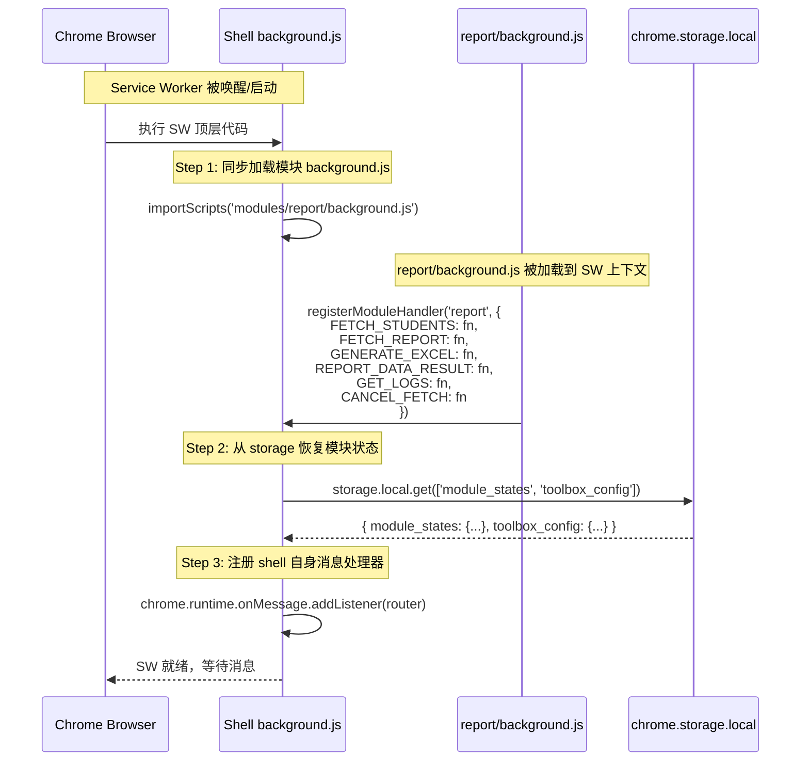
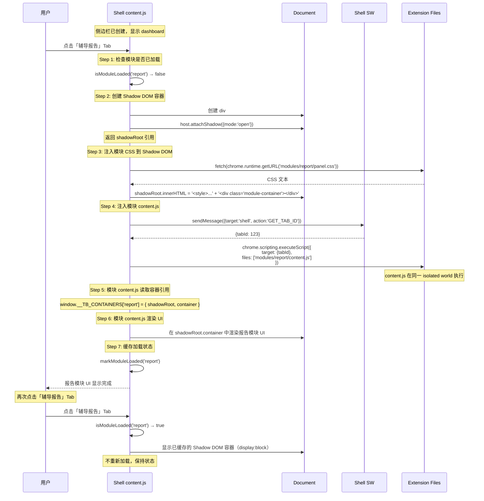
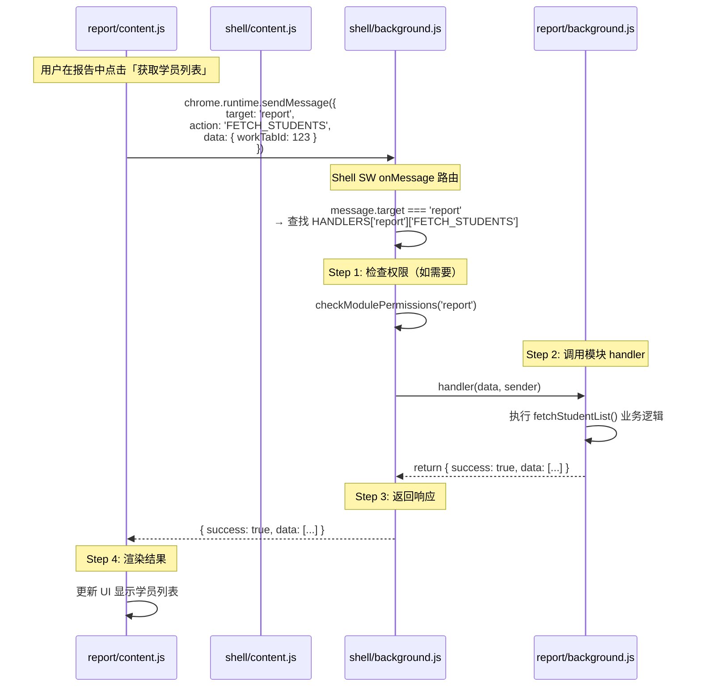
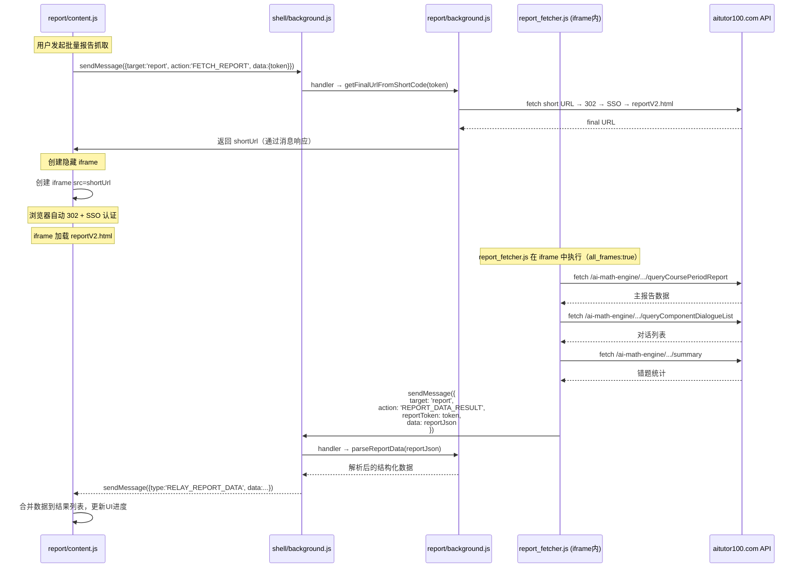
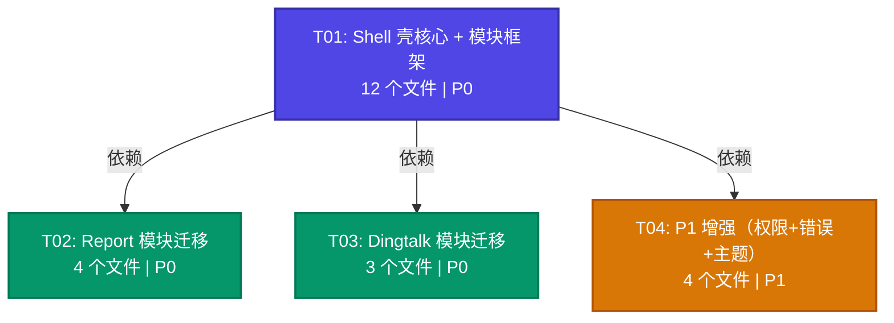

# Toolbox Phase2 系统架构设计文档

> **版本**: v2.0.0
> **日期**: 2026-03-25
> **作者**: 架构师 (Bob)
> **基于**: toolbox-phase2-prd.md v2.0.0 + 全量源码分析

---

## 目录

1. [实现方案概述](#1-实现方案概述)
2. [技术选型](#2-技术选型)
3. [文件列表](#3-文件列表)
4. [数据结构与接口](#4-数据结构与接口)
5. [程序调用流程](#5-程序调用流程)
6. [Q1-Q4 解决方案](#6-q1-q4-解决方案)
7. [任务列表（按依赖排序）](#7-任务列表按依赖排序)
8. [依赖包](#8-依赖包)
9. [共享约定](#9-共享约定)
10. [待确认 / 开放问题](#10-待确认--开放问题)
11. [任务依赖关系图](#11-任务依赖关系图)

---

## 1. 实现方案概述

### 1.1 核心难点分析

本项目的本质是将两个独立 Chrome 扩展（report、dingtalk）**嵌入**一个 toolbox 壳扩展中，同时建立模块化架构使未来新增模块只需"放文件 + 加 module.json"。核心难点有 5 个：

| # | 难点 | 影响 | 复杂度 |
|---|------|------|--------|
| D1 | MV3 只允许一个 Service Worker，模块的 background.js 如何共存 | 消息总线、模块注册 | 高 |
| D2 | CSS 隔离 — 模块间样式互不干扰 | Shadow DOM 渲染方案 | 中 |
| D3 | 按需加载 — Tab 点击后才加载模块资源 | 动态注入机制 | 中 |
| D4 | report_fetcher.js 的 `all_frames` iframe 注入如何迁移 | manifest 声明 + 消息路由 | 低 |
| D5 | dingtalk 浮动面板与 Shadow DOM 的兼容 | 双容器方案（侧边栏 + 浮动面板） | 中 |

### 1.2 架构模式：Hub-and-Spoke

采用 **Hub-and-Spoke（中心辐射）** 模式：

- **Hub（壳）**：负责模块注册、消息路由、Tab 管理、Shadow DOM 容器管理、权限管理
- **Spoke（模块）**：自包含的业务单元，拥有独立的 background.js、content.js、CSS，通过消息总线与壳和其他模块通信

```
                    ┌─────────────────────────────┐
                    │     Chrome Extension API     │
                    └──────────┬──────────────────┘
                               │
              ┌────────────────┼────────────────┐
              │                │                 │
     ┌────────▼────────┐  ┌───▼──────────┐  ┌───▼──────────┐
     │  Shell Content   │  │ Shell Popup  │  │Shell Service │
     │  (Sidebar+Tabs)  │  │ (Module Mgmt)│  │   Worker     │
     └────────┬────────┘  └──────┬───────┘  │  (Message    │
              │                  │           │   Bus/Route) │
     ┌────────▼────────┐         │           └──────┬───────┘
     │  Shadow DOM      │         │                  │
     │  ┌────────────┐ │         │           ┌──────▼───────┐
     │  │ Report UI   │ │         │           │ Report BG    │
     │  ├────────────┤ │         │           │ (Handlers)   │
     │  │ Dingtalk UI │ │         │           └──────────────┘
     │  └────────────┘ │         │
     └─────────────────┘         │
     ┌─────────────────┐         │
     │ Dingtalk Floating│         │
     │ Panel (Shadow)   │         │
     └─────────────────┘         │
```

### 1.3 关键设计决策

| 决策 | 方案 | 理由 |
|------|------|------|
| SW 共存 | 壳 SW 不设 `"type": "module"`，用 `importScripts()` 在顶层加载模块 background.js | report 的 background.js 实际未使用 `import/export` 语法，代码兼容 classic SW |
| CSS 隔离 | Shadow DOM（`attachShadow({mode:'open'})`) | MV3 兼容，完全隔离，模块无需改 CSS 选择器 |
| 按需加载 | Tab 点击时 fetch 模块 CSS → 注入 Shadow DOM → `chrome.scripting.executeScript` 注入 content.js | 利用现有 `scripting` 权限，无需新增 build 工具 |
| 模块注册 | `module.json` 自描述 + shell SW 顶层 `importScripts` + handler 自注册 | 简单直接，新增模块只需加一行 `importScripts` |
| 消息路由 | `{ target, action, data }` 格式，shell SW 按 `target` 字段分发 | PRD 已确认的方案，实现简洁 |
| dingtalk 浮动面板 | 在 `document.body` 上创建独立 Shadow DOM host（非侧边栏内） | 浮动面板需要覆盖宿主页面，不能放在侧边栏 Shadow DOM 内 |

---

## 2. 技术选型

| 领域 | 选型 | 理由 |
|------|------|------|
| 运行环境 | Chrome Extension Manifest V3 | 需求约束 |
| 前端框架 | **无**（纯 HTML/CSS/JS） | 需求约束，简单直接 |
| CSS 隔离 | Shadow DOM (`mode: 'open'`) | MV3 兼容，零配置 |
| SW 模块加载 | `importScripts()` | MV3 classic SW 原生支持 |
| 动态 JS 注入 | `chrome.scripting.executeScript()` | MV3 推荐方式，利用现有 `scripting` 权限 |
| CSS 注入 | `fetch()` + Shadow DOM `<style>` | 配合 Shadow DOM 隔离 |
| 状态持久化 | `chrome.storage.local` | SW 可被终止，需持久化 |
| 会话状态 | `chrome.storage.session` | SW 唤醒间保持，比 local 高效 |
| 权限管理 | `optional_permissions` API | MV3 原生支持，按需申请 |
| 打包工具 | Node.js 原生 ZIP + CRX 封装（现有 build.js） | 无新 build 依赖 |

**不使用的方案及理由**：
- ❌ `iframe` 隔离：增加通信复杂度，DOM 操作不直观
- ❌ `"type": "module"` SW：`importScripts()` 不可用，需重构为 `import()` 动态导入，增加复杂度
- ❌ `chrome.scripting.registerContentScripts()`：虽然更灵活，但 static manifest 声明更简单且无需动态管理生命周期

---

## 3. 文件列表

### 3.1 完整目录结构

```
plugins/toolbox/
├── manifest.json                          # [修改] 合并权限，添加 report_fetcher content_scripts
├── background.js                          # [重写] 消息总线 + importScripts + 模块注册 (~80行)
├── content.js                             # [重写] 动态Tab + Shadow DOM + 按需加载
├── popup.html                             # [修改] 动态模块列表 + 启用/禁用开关
├── popup.js                               # [修改] 模块管理交互逻辑
├── panel.css                              # [修改] 适配新Tab系统和统一主题变量
├── modules/
│   ├── report/
│   │   ├── module.json                    # [新建] 模块描述文件
│   │   ├── background.js                  # [迁移+重构] 转为handler注册模式
│   │   ├── content.js                     # [迁移+重构] Shadow DOM渲染，移除自建sidebar
│   │   ├── report_fetcher.js              # [迁移] 添加 target:'report' 到消息
│   │   ├── analysis.js                    # [迁移] 纯函数，基本不变
│   │   ├── panel.css                      # [迁移+修改] 去除fixed定位，适配Shadow DOM
│   │   └── report.svg                     # [新建] 模块图标
│   └── dingtalk/
│       ├── module.json                    # [新建] 模块描述文件
│       ├── content.js                     # [迁移+重构] 去除window全局变量+Shadow DOM
│       ├── extractor.js                   # [新建] 从content.js拆出表格提取逻辑
│       ├── style.css                      # [迁移+修改] 适配Shadow DOM
│       └── dingtalk.svg                   # [新建] 模块图标
├── icons/                                 # [不变] 现有图标
└── (popup.css 内联在 popup.html)          # 无独立CSS文件

build.js                                   # [修改] 支持 toolbox 打包（含模块文件）
```

### 3.2 文件变更说明

| 文件 | 操作 | 变更幅度 | 说明 |
|------|------|----------|------|
| `manifest.json` | 修改 | 中 | 添加 `cookies`/`downloads` 权限、`optional_permissions`、report_fetcher content_scripts、模块文件到 `web_accessible_resources` |
| `background.js` | 重写 | 高 | 从119行硬编码注册表 → ~80行消息总线 + importScripts |
| `content.js` | 重写 | 高 | 从506行硬编码Tab → 动态生成Tab + Shadow DOM + 按需加载 |
| `popup.html` | 修改 | 中 | 添加模块启用/禁用开关、dingtalk去重模式选择器 |
| `popup.js` | 修改 | 中 | 动态模块列表渲染 + 设置持久化 |
| `panel.css` | 修改 | 低 | 添加 CSS 变量、微调Tab样式 |
| `modules/report/module.json` | 新建 | — | 模块元数据描述 |
| `modules/report/background.js` | 迁移+重构 | 高 | 455行 → 转为 handler 注册模式 + 状态持久化 |
| `modules/report/content.js` | 迁移+重构 | 高 | 1156行 → 去除自建sidebar、适配Shadow DOM容器 |
| `modules/report/report_fetcher.js` | 迁移 | 低 | 100行 → 添加 `target:'report'` 到消息（1行改动） |
| `modules/report/analysis.js` | 迁移 | 低 | 272行 → 纯函数基本不变 |
| `modules/report/panel.css` | 迁移+修改 | 中 | 去除 `position:fixed`、`right:0`、`width:420px`，适配Shadow DOM |
| `modules/dingtalk/module.json` | 新建 | — | 模块元数据描述 |
| `modules/dingtalk/content.js` | 迁移+重构 | 高 | 753行 → 去除window全局变量、双容器（sidebar+浮动面板Shadow DOM） |
| `modules/dingtalk/extractor.js` | 新建 | — | 从content.js拆出：表格检测、数据提取、智能去重核心逻辑 |
| `modules/dingtalk/style.css` | 迁移+修改 | 中 | 适配Shadow DOM |
| `build.js` | 修改 | 中 | 扩展支持 toolbox 打包，更新 `SRC_DIR` |

---

## 4. 数据结构与接口

### 4.1 模块配置结构（module.json）

```mermaid
classDiagram
    class ModuleConfig {
        +string name              "report"
        +string label             "辅导报告"
        +string version           "1.0.0"
        +string icon              "report.svg"
        +string description       "模块功能描述"
        +string[] permissions     ["cookies", "downloads"]
        +string[] hostPermissions  ["https://.../*"]
        +EntryConfig entry
        +ContentScriptConfig[] contentScripts
        +boolean hasBackground    true
    }

    class EntryConfig {
        +string content    "content.js"
        +string background "background.js"
        +string css        "panel.css"
    }

    class ContentScriptConfig {
        +string[] matches  ["https://next.aitutor100.com/reportV2.html*"]
        +string js         "report_fetcher.js"
        +boolean allFrames true
        +string runAt      "document_idle"
    }

    class ModuleState {
        +string name
        +string status      "registered|enabled|loaded|active|error"
        +boolean enabled    true
        +string error       null
        +number loadedAt    1711400000000
    }

    class HandlerRegistry {
        +Map handlers      "moduleName → Map(action → handlerFn)"
        +register(moduleName, actionMap) void
        +getHandler(moduleName, action) Function
        +hasHandler(moduleName, action) boolean
    }

    class Message {
        +string target      "report" | "shell"
        +string action      "FETCH_STUDENTS"
        +Object data        "{ ... }"
    }

    ModuleConfig --> EntryConfig
    ModuleConfig --> ContentScriptConfig
    HandlerRegistry --> Message
```

### 4.2 module.json 示例

**report 模块** (`modules/report/module.json`):
```json
{
  "name": "report",
  "label": "辅导报告",
  "version": "5.1.1",
  "icon": "report.svg",
  "description": "批量获取学生听课质量报告，自动生成四维评价分析",
  "permissions": ["cookies", "downloads"],
  "hostPermissions": [
    "https://ai-genesis.yuaiweiwu.com/*",
    "https://s1.aiv5.cc/*",
    "https://next.aitutor100.com/*",
    "https://*.aitutor100.com/*"
  ],
  "hasBackground": true,
  "entry": {
    "content": "content.js",
    "background": "background.js",
    "css": "panel.css"
  },
  "contentScripts": [
    {
      "matches": ["https://next.aitutor100.com/reportV2.html*"],
      "js": ["report_fetcher.js"],
      "allFrames": true,
      "runAt": "document_idle"
    }
  ]
}
```

**dingtalk 模块** (`modules/dingtalk/module.json`):
```json
{
  "name": "dingtalk",
  "label": "钉钉数据提取",
  "version": "1.0.0",
  "icon": "dingtalk.svg",
  "description": "从钉钉网页提取表格数据，支持智能去重和CSV导出",
  "permissions": [],
  "hostPermissions": [],
  "hasBackground": false,
  "entry": {
    "content": "content.js",
    "css": "style.css"
  }
}
```

### 4.3 消息格式规范

所有模块间通信使用统一消息格式：

```javascript
// Content → SW → Module Handler
{
  target: "report",       // 目标模块名，"shell" 表示壳自身
  action: "FETCH_STUDENTS", // 动作名称（大写蛇形）
  data: {                 // 业务数据载荷
    workTabId: 123,
    filters: { ... }
  }
}

// 响应格式（统一）
{
  success: true,          // 布尔
  data: { ... },          // 业务数据
  error: null             // 错误信息（失败时）
}
```

**消息流转规则**：
1. Content script 发送 → `chrome.runtime.sendMessage(message)`
2. Shell SW 的 `onMessage` 监听器根据 `message.target` 路由
3. `target === "shell"` → shell 自行处理
4. `target === "report"` → 查 `HANDLERS["report"]["FETCH_STUDENTS"]` 并调用
5. Handler 返回 `Promise` 或通过 `sendResponse` 返回

### 4.4 Shell 全局注册 API（在 SW 中暴露给模块）

```javascript
// === Shell SW 暴露给模块 background.js 的注册函数 ===

/**
 * 模块注册其消息处理器
 * @param {string} moduleName - 模块名称，与 module.json 的 name 一致
 * @param {Object} actionMap - { ACTION_NAME: async (data, sender) => result }
 */
function registerModuleHandler(moduleName, actionMap) {
  // Shell SW 内部实现
}

/**
 * 模块注册其状态变更回调
 * @param {string} moduleName
 * @param {Function} onStatusChange - (newStatus) => void
 */
function registerModuleStatusCallback(moduleName, onStatusChange) {
  // Shell SW 内部实现
}
```

---

## 5. 程序调用流程

### 5.1 SW 启动 + 模块注册流程



### 5.2 Tab 点击 → 按需加载模块流程



### 5.3 消息路由流程（Content → SW → Module Handler）



### 5.4 Report iframe 数据抓取流程



---

## 6. Q1-Q4 解决方案

### Q1: 模块的 background.js 与壳的 background.js 如何共存？

**结论：使用 `importScripts()` 在壳 SW 顶层同步加载模块 background.js**

**分析**：

| 项目 | 现状 | 关键发现 |
|------|------|----------|
| report manifest | `"type": "module"` | 声明了模块类型 |
| report background.js 实际代码 | 无 `import`/`export` 语句 | 纯函数声明 + `chrome.runtime.onMessage.addListener`，**实际不依赖 ES module** |
| toolbox manifest | 无 `"type"` 字段 | 默认为 classic SW |

**方案详情**：

1. **Shell manifest 不设置 `"type": "module"`**，保持 classic SW 模式
2. Shell background.js 顶层调用 `importScripts()`：
   ```javascript
   // background.js 顶层（同步执行）
   // ========== 模块 Handler 注册 ==========
   const MODULE_HANDLERS = {};

   function registerModuleHandler(moduleName, actionMap) {
     MODULE_HANDLERS[moduleName] = { ...MODULE_HANDLERS[moduleName], ...actionMap };
   }

   // 同步加载所有有 background.js 的模块
   try {
     importScripts(
       'modules/report/background.js'
       // dingtalk 无 background.js，不在此加载
     );
   } catch(e) {
     console.error('[toolbox] 模块加载失败:', e);
   }
   ```
3. Report background.js 改造要点：
   - 移除直接的 `chrome.runtime.onMessage.addListener()` 调用
   - 改为 `registerModuleHandler('report', { FETCH_STUDENTS, FETCH_REPORT, ... })`
   - 将内存状态（`_recentLogs`、`_workTabId`）迁移到 `chrome.storage.session`
4. **新增模块时**：在 `importScripts()` 调用中添加一行路径即可

**风险与缓解**：
- `importScripts` 必须在 SW 顶层同步调用（MV3 约束），不能在异步回调中使用 → 已在设计中满足
- 模块代码抛异常会阻止后续模块加载 → 用 `try/catch` 包裹，失败模块标记为 `error` 状态
- SW 终止后重新唤醒时 `importScripts` 重新执行 → 设计为幂等（`registerModuleHandler` 是覆盖写入，多次调用安全）

### Q2: Dingtalk 模块的去重模式选择如何保留？

**结论：在 toolbox sidebar 的 dingtalk 模块区域内置去重模式选择器**

**分析**：

| 现有方案 | 位置 | 问题 |
|----------|------|------|
| dingtalk popup.html 的 `<select id="dedup-mode">` | 独立扩展 popup | 迁入 toolbox 后无独立 popup |

**方案详情**：

1. **主要入口**：在 toolbox 侧边栏的 dingtalk Tab 内容区域顶部添加去重模式选择器
   - 当用户点击「钉钉数据」Tab 时，dingtalk 模块的 content.js 在 Shadow DOM 中渲染
   - 顶部区域包含：去重模式 `<select>`（`id+time` / `id-only`）、开始/停止/下载按钮、状态显示
   - 去重模式变更时存入 `chrome.storage.local`，key 为 `dingtalk.dedupMode`

2. **辅助入口**：toolbox 的 popup.html 中增加钉钉模块的快速设置区域
   - 在模块列表的 dingtalk 项旁显示当前去重模式
   - 点击可切换模式

3. **存储**：
   ```javascript
   // 读取（模块 content.js）
   const { 'dingtalk.dedupMode': mode } = await chrome.storage.local.get('dingtalk.dedupMode');

   // 写入（模块 content.js 或 popup.js）
   chrome.storage.local.set({ 'dingtalk.dedupMode': 'id+time' });
   ```

**不再需要**：`chrome.storage.sync`（当前 dingtalk 使用），统一改为 `chrome.storage.local` 并加模块前缀。

### Q3: Report 模块 report_fetcher.js 的 `all_frames` 注入策略

**结论：在 shell manifest.json 的 `content_scripts` 中声明，路径指向模块目录**

**方案详情**：

1. Shell manifest.json 添加 content_scripts 条目：
   ```json
   {
     "matches": ["https://next.aitutor100.com/reportV2.html*"],
     "js": ["modules/report/report_fetcher.js"],
     "run_at": "document_idle",
     "all_frames": true
   }
   ```

2. report_fetcher.js 的唯一改动 — 消息添加 `target` 字段：
   ```javascript
   // 改前
   chrome.runtime.sendMessage({
     type: 'REPORT_DATA_RESULT',
     reportToken: report,
     data: reportJson
   });

   // 改后
   chrome.runtime.sendMessage({
     target: 'report',
     action: 'REPORT_DATA_RESULT',
     reportToken: report,
     data: reportJson,
     _dialogue: dialogueJson,
     _summary: summaryJson
   });
   ```

3. **iframe 内 shell content.js 防冲突**：shell content.js 声明为 `<all_urls>` 匹配，也会在 iframe 中运行。添加顶层守卫：
   ```javascript
   // content.js 顶层
   if (window.self !== window.top) return; // 不在 iframe 中运行
   ```

### Q4: 现有独立扩展的用户数据迁移

**结论：在 shell SW 的 `onInstalled` 中实现一次性数据迁移**

**分析**：

| 扩展 | 存储位置 | 存储键 | 存储类型 |
|------|----------|--------|----------|
| report | chrome.storage.local | `toolbox_version`, `sidebar_position`, `sidebar_width`, `theme`, `modules_enabled` | local |
| dingtalk | chrome.storage.sync | `dedupMode` | sync |

**方案详情**：

1. **迁移时机**：shell SW 的 `chrome.runtime.onInstalled` 事件，`reason === 'install'` 时触发
2. **迁移方式**：由于独立扩展被卸载后数据不可访问，迁移窗口仅存在于扩展共存期间
3. **实际策略**：
   - **推荐路径**：用户手动卸载旧扩展前，先安装 toolbox → toolbox 在首次启动时检测旧扩展是否存在 → 如果存在，读取其数据并复制
   - **检测旧扩展**：尝试通过 `chrome.runtime.sendMessage` 向已知扩展 ID 发消息，超时则说明未安装
   - **降级路径**：如果旧扩展已被卸载，提供「导入配置」按钮让用户手动输入关键配置

4. **迁移代码逻辑**（在 shell background.js 的 `onInstalled` 中）：
   ```javascript
   chrome.runtime.onInstalled.addListener(async (details) => {
     if (details.reason === 'install') {
       // 尝试从旧 report 扩展迁移数据
       try {
         // 检测旧扩展是否存在（通过已知的扩展 ID）
         const oldReportId = '...'; // report 扩展的 ID
         await chrome.runtime.sendMessage(oldReportId, { type: 'PING' });
         // 如果成功，说明旧扩展存在，读取其数据
         // (通过 cross-extension messaging 获取)
       } catch(e) {
         // 旧扩展不存在，跳过迁移
       }

       // 初始化默认配置
       chrome.storage.local.set({
         toolbox_version: '2.0.0',
         module_states: {
           report: { enabled: true, status: 'registered' },
           dingtalk: { enabled: true, status: 'registered' }
         },
         'dingtalk.dedupMode': 'id+time' // 默认去重模式
       });
     }
   });
   ```

5. **存储键加前缀规范**：所有模块存储键使用 `moduleName.keyName` 格式（如 `report.workTabId`、`dingtalk.dedupMode`），避免模块间冲突。

---

## 7. 任务列表（按依赖排序）

### T01: 项目基础设施 — Shell 壳核心 + 模块框架 + 配置 + 打包

**说明**：搭建整个模块化壳的骨架，包括消息总线、动态 Tab、Shadow DOM 容器管理、模块配置文件、manifest 权限合并、打包脚本升级。本任务是所有后续任务的基础。

| 属性 | 值 |
|------|-----|
| **Task ID** | T01 |
| **优先级** | P0 |
| **依赖** | 无（首个任务） |
| **预估代码量** | ~600 行（新建+修改） |

**源文件清单**：

| # | 文件路径 | 操作 | 核心内容 |
|---|----------|------|----------|
| 1 | `plugins/toolbox/manifest.json` | 修改 | 添加 `cookies`/`downloads` 权限到 permissions；添加 `optional_permissions` 字段；添加 report_fetcher content_scripts 条目（all_frames）；更新 `web_accessible_resources` 包含 `modules/**/*`；version 升至 `2.0.0` |
| 2 | `plugins/toolbox/background.js` | 重写 | 定义 `MODULE_HANDLERS` 全局 Map + `registerModuleHandler()` 函数 + `importScripts('modules/report/background.js')` 顶层调用 + `chrome.runtime.onMessage` 路由器（按 `message.target` 分发）+ shell 自身 handler（GET_MODULE_LIST、STORAGE_GET/SET、MODULE_STATUS_UPDATE、REQUEST_PERMISSIONS）+ `onInstalled` 初始化逻辑 + iframe 防冲突守护 |
| 3 | `plugins/toolbox/content.js` | 重写 | 顶层 `if (window.self !== window.top) return` 守卫 + 动态 sidebar 创建（header + 动态 tab 栏 + content 区域 + footer）+ `createShadowContainer(moduleName)` 创建 Shadow DOM + `loadModuleCSS(moduleName)` fetch CSS 注入 shadowRoot + `loadModuleJS(moduleName)` 通过 `chrome.scripting.executeScript` 注入 + `switchTab(name)` 切换逻辑（隐藏/显示已加载模块的 Shadow DOM，按需加载未加载模块）+ 暴露 `window.__TB_CONTAINERS` 供模块 content.js 读取 + 从 SW 获取模块列表动态生成 tab |
| 4 | `plugins/toolbox/panel.css` | 修改 | 定义 CSS 变量（`--tb-primary`, `--tb-bg`, `--tb-text`, `--tb-border`, `--tb-font`）用于统一主题；微调 `.tb-tab` 样式支持动态数量；添加 `.tb-module-error` 错误状态样式 |
| 5 | `plugins/toolbox/popup.html` | 修改 | 添加模块启用/禁用 toggle 开关（每个模块项旁）；添加 dingtalk 去重模式选择器区域；添加「设置」面板样式 |
| 6 | `plugins/toolbox/popup.js` | 修改 | 动态从 SW 获取模块列表（含 enabled 状态）渲染；toggle 开关绑定 `chrome.storage.local` 持久化；dingtalk 去重模式下拉绑定存储 |
| 7 | `plugins/toolbox/modules/report/module.json` | 新建 | 模块描述文件（name, label, version, icon, permissions, hostPermissions, hasBackground, entry, contentScripts）|
| 8 | `plugins/toolbox/modules/dingtalk/module.json` | 新建 | 模块描述文件（name, label, version, icon, permissions, hasBackground:false, entry）|
| 9 | `plugins/toolbox/modules/report/report_fetcher.js` | 迁移 | 从 `plugins/report/report_fetcher.js` 复制，唯一改动：消息中添加 `target:'report'` 字段（第 84 行和第 95 行） |
| 10 | `plugins/toolbox/modules/report/report.svg` | 新建 | 模块图标 SVG 文件 |
| 11 | `plugins/toolbox/modules/dingtalk/dingtalk.svg` | 新建 | 模块图标 SVG 文件 |
| 12 | `build.js` | 修改 | 更新 `SRC_DIR` 指向 `plugins/toolbox`；更新 `EXT_ID` 为 `toolbox`；更新 `EXT_NAME` 为 `插件工作箱`；确保 `createZipFromDir` 递归包含 `modules/` 子目录 |

---

### T02: Report 模块完整迁移（background + analysis + content + CSS）

**说明**：将现有的 report 扩展全部功能迁移为 toolbox 的一个模块。包括 Service Worker handler 注册、分析引擎、UI 渲染到 Shadow DOM、样式适配。

| 属性 | 值 |
|------|-----|
| **Task ID** | T02 |
| **优先级** | P0 |
| **依赖** | T01 |
| **预估代码量** | ~1900 行（迁移+重构） |

**源文件清单**：

| # | 文件路径 | 操作 | 核心内容 |
|---|----------|------|----------|
| 1 | `modules/report/background.js` | 迁移+重构 | 从 `plugins/report/background.js`（455行）迁移。**关键改动**：(1) 移除直接的 `chrome.runtime.onMessage.addListener()` 调用，改为 `registerModuleHandler('report', { FETCH_STUDENTS, FETCH_REPORT, REPORT_DATA_RESULT, GET_LOGS, CANCEL_FETCH })`(2) 将 `_recentLogs` 和 `_workTabId` 内存变量改为 `chrome.storage.session` 读写 (3) `workApi()` 保持不变（`credentials:'include'` + host_permissions 保证可用）(4) `parseReportData()`、`generateExcel()` 等纯函数保持不变 (5) `REGISTER_TAB` handler 改为接收 tabId 参数而非 sender.tab |
| 2 | `modules/report/analysis.js` | 迁移 | 从 `plugins/report/analysis.js`（272行）直接复制。纯函数 IIFE 模式无需修改。后续可考虑合并 content.js 中重复的内联分析逻辑（`analyzeStudent`），但 P0 阶段保持现状 |
| 3 | `modules/report/content.js` | 迁移+重构 | 从 `plugins/report/content.js`（1156行）迁移。**关键改动**：(1) **移除** 自建 sidebar 创建逻辑（`#lrp-panel-container`、`position:fixed`、`right:0`、`width:420px` 的外层容器）(2) **移除** 面板的 open/close 切换逻辑（壳负责）(3) **改为** 从 `window.__TB_CONTAINERS['report'].shadowRoot` 获取容器引用，在其中渲染模块内容 (4) **移除** 内联 CSS（由壳通过 Shadow DOM `<style>` 注入 panel.css）(5) iframe pool 逻辑（`fetchViaIframe`、`runPool`）保持不变 (6) DOM 抓取逻辑（`extractPageFilters`、`scrapeReportLinkIds`）保持不变 (7) 表格渲染、排序、过滤逻辑保持不变 (8) CSV 导出改为通过 `sendMessage({target:'report', action:'DOWNLOAD_CSV'})` 触发 SW 下载（利用壳的 `downloads` 权限）|
| 4 | `modules/report/panel.css` | 迁移+修改 | 从 `plugins/report/panel.css`（226行）迁移。**关键改动**：(1) **移除** `.lrp-panel-container` 的 `position:fixed; right:0; width:420px; z-index:2147483647`（由壳的 Shadow DOM 容器提供定位）(2) **移除** `.lrp-panel-container` 的 `top/bottom/left/right` 定位属性 (3) 所有 `.lrp-` 前缀的样式保留（在 Shadow DOM 内无需担心冲突，但保持一致性）(4) 添加 `.lrp-module-container` 作为根容器样式（`display:flex; flex-direction:column; height:100%; overflow:hidden`）|

**注意事项**：
- content.js 中的内联 `analyzeStudent()` 函数与 `analysis.js` 的逻辑存在差异（v5.1.0 内联版 vs 外部文件版）。P0 阶段保持两份代码共存，后续统一
- `generateExcel()` 当前使用 CSV + `<a download>` 方式。在 Shadow DOM 内 `<a download>` 可正常工作，无需改为 SW 下载

---

### T03: Dingtalk 模块迁移（content + extractor + CSS）

**说明**：将 dingtalk 扩展迁移为 toolbox 模块。核心挑战是去除 `window` 全局变量污染，并将浮动面板通过 Shadow DOM 实现样式隔离。同时拆分表格提取逻辑为独立文件。

| 属性 | 值 |
|------|-----|
| **Task ID** | T03 |
| **优先级** | P0 |
| **依赖** | T01 |
| **预估代码量** | ~1100 行（迁移+重构+拆分） |

**源文件清单**：

| # | 文件路径 | 操作 | 核心内容 |
|---|----------|------|----------|
| 1 | `modules/dingtalk/content.js` | 迁移+重构 | 从 `plugins/dingtalk/content.js`（753行）迁移。**关键改动**：(1) **封装全局变量**：将 `window.extractedData`、`window.uniqueKeys`、`window.isRunning`、`window.shouldStop`、`window.selectedTable`、`window.dedupMode` 等全部封装到模块作用域对象 `const DingtalkState = { extractedData: [], uniqueKeys: new Set(), ... }`(2) **双容器架构**：侧边栏 UI（去重模式选择器 + 状态 + 启动/停止/下载按钮）渲染在壳提供的 `window.__TB_CONTAINERS['dingtalk'].shadowRoot` 内；浮动控制面板渲染在独立 Shadow DOM host（`document.body` → `attachShadow`）(3) **去重模式选择器**：从 popup 迁移到 sidebar Shadow DOM 内，读取/写入 `chrome.storage.local` 的 `dingtalk.dedupMode`(4) 移除 `createControlPanel()` 中直接 `document.body.appendChild` 的逻辑，改为浮动面板 Shadow DOM 方案 (5) 事件监听器全部在模块作用域内 |
| 2 | `modules/dingtalk/extractor.js` | 新建（拆分） | 从 content.js 中提取的纯数据逻辑：`detectTables()` — 3 种表格检测策略（传统table、Vue/Ant Design容器、fallback容器搜索）；`extractTableData(tableEl)` — 单表格数据提取；`dedupRecords(records, mode)` — 智能去重（`id+time` / `id-only`）；`scrollAndExtract(options)` — 自动滚动提取循环。返回模块对象供 content.js 调用：`const TableExtractor = { detectTables, extractTableData, dedupRecords, scrollAndExtract }` |
| 3 | `modules/dingtalk/style.css` | 迁移+修改 | 从 `plugins/dingtalk/style.css`（315行）迁移。**关键改动**：(1) `#dingtalk-extractor-panel` 的 `position:fixed; z-index:2147483647` 保留（浮动面板仍需固定定位，只是宿主改为 Shadow DOM）(2) 移除 `!important` 声明（Shadow DOM 内无需覆盖宿主页面样式）(3) 添加 `.dt-sidebar-section` 样式用于侧边栏内的控制区域（去重选择器、状态显示）(4) 添加 `.dt-floating-panel` 样式作为浮动面板根容器 |

**dingtalk 模块的独特架构说明**：

Dingtalk 与 Report 不同，它有两个 UI 容器：
1. **侧边栏容器**（由壳提供）：显示去重模式选择器、启动/停止按钮、状态信息、数据预览
2. **浮动面板容器**（模块自建）：附着在 `document.body` 上的 Shadow DOM，显示实时提取进度和快捷控制

```
document.body
├── #toolbox-sidebar (壳侧边栏)
│   └── shadowRoot
│       └── .tb-panel[data-panel="dingtalk"]
│           └── shadowRoot (dingtalk sidebar)
│               ├── .dt-sidebar-section (去重模式、按钮)
│               └── .dt-data-preview (数据预览表格)
└── #dingtalk-floating-host (模块自建)
    └── shadowRoot
        └── .dt-floating-panel (进度条、停止按钮)
```

---

### T04: P1 增强功能 — 权限管理 + 错误处理 + 统一主题

**说明**：在 P0 基础上增强用户体验：模块权限按需申请、加载失败友好提示、Tab 切换状态保持、统一主题 CSS 变量。

| 属性 | 值 |
|------|-----|
| **Task ID** | T04 |
| **优先级** | P1 |
| **依赖** | T01（仅依赖壳，不依赖 T02/T03 的具体实现） |
| **预估代码量** | ~400 行（增强现有文件） |

**源文件清单**：

| # | 文件路径 | 操作 | 核心内容 |
|---|----------|------|----------|
| 1 | `plugins/toolbox/background.js` | 增强 (T01产物) | 添加 `REQUEST_PERMISSIONS` handler：读取 module.json 的 permissions/hostPermissions → 调用 `chrome.permissions.request()` → 返回授权结果；添加权限检查逻辑到消息路由器：路由到模块 handler 前检查该模块权限是否已授权 |
| 2 | `plugins/toolbox/content.js` | 增强 (T01产物) | Tab 切换时保持已加载模块 DOM（`display:none` 而非 `removeChild`）；模块加载失败时显示友好错误 UI（图标 + "加载失败" + 重试按钮）；首次加载模块前触发权限申请弹窗（通过 `sendMessage({target:'shell', action:'REQUEST_PERMISSIONS', data:{module:'report'}})`）|
| 3 | `plugins/toolbox/popup.js` | 增强 (T01产物) | 模块启用/禁用 toggle 的实际逻辑：`chrome.storage.local` 持久化 → 通知 content.js 刷新 tab 列表；禁用的模块在 sidebar 中显示为灰色且不可点击 |
| 4 | `plugins/toolbox/panel.css` | 增强 (T01产物) | 添加 dark mode CSS 变量组（`--tb-bg-dark`, `--tb-text-dark` 等）；添加 `.tb-module-error` 和 `.tb-module-disabled` 样式；添加 `.tb-permission-dialog` 权限申请弹窗样式 |

---

## 8. 依赖包

### 运行时（Chrome Extension）

**无需任何第三方 npm 包**。本项目完全基于 Chrome Extension 原生 API：

| API | 用途 | 权限要求 |
|-----|------|----------|
| `chrome.runtime.onMessage` / `sendMessage` | 消息通信 | 内置 |
| `chrome.scripting.executeScript` | 动态注入 content script | `scripting`（已有） |
| `chrome.storage.local` / `session` | 状态持久化 | `storage`（已有） |
| `chrome.permissions.request` / `contains` | 按需权限申请 | 内置 |
| `chrome.tabs.sendMessage` / `query` | 标签页通信 | 内置 |
| `importScripts()` | SW 模块加载 | SW 内置 |
| `Element.attachShadow()` | Shadow DOM | Content Script 内置 |
| `fetch()` | 获取模块 CSS/JS 资源 | 内置 |

### 构建时（build.js）

| 包 | 版本 | 用途 |
|----|------|------|
| **无外部依赖** | — | build.js 使用纯 Node.js 内置模块（`fs`, `path`, `crypto`, `child_process`）实现 ZIP 打包 |

### Manifest 权限变更对比

| 权限 | 现有 toolbox | Phase2 toolbox | 来源 |
|------|-------------|----------------|------|
| `activeTab` | ✅ | ✅ | 保留 |
| `storage` | ✅ | ✅ | 保留 |
| `scripting` | ✅ | ✅ | 保留 |
| `cookies` | ❌ | ✅ **新增** | report 模块需要 |
| `downloads` | ❌ | ✅ **新增** | report 模块 CSV 下载 |
| `optional_permissions` | ❌ | ✅ **新增** | 按需权限申请机制 |
| host_permissions | 3 域 | 3 域 + `*.aitutor100.com/*` | 合并 report 需要的通配域 |

---

## 9. 共享约定

### 9.1 消息格式

```javascript
// 发送（所有模块统一）
const message = {
  target: 'report',           // 'shell' | 模块名
  action: 'ACTION_NAME',     // 大写蛇形命名
  data: { /* 业务数据 */ }
};

// 响应（所有 handler 统一）
const response = {
  success: true,              // boolean
  data: { /* 返回数据 */ },
  error: null                 // string | null
};
```

### 9.2 命名规范

| 类别 | 规范 | 示例 |
|------|------|------|
| CSS 类名（壳） | `.tb-` 前缀 | `.tb-header`, `.tb-tab`, `.tb-panel` |
| CSS 类名（模块） | 模块缩写前缀 | `.lrp-`（report）、`.dt-`（dingtalk） |
| 存储键 | `moduleName.keyName` | `report.workTabId`, `dingtalk.dedupMode` |
| 消息 action | `UPPER_SNAKE_CASE` | `FETCH_STUDENTS`, `REPORT_DATA_RESULT` |
| 模块目录名 | 小写英文 | `report`, `dingtalk` |
| 全局暴露（content） | `window.__TB_*` | `window.__TB_CONTAINERS` |

### 9.3 模块开发约束

1. **禁止使用 `window` 全局变量**（除壳暴露的 `window.__TB_*` 接口）
2. **所有 UI 渲染在 Shadow DOM 内**（浮动面板使用独立 Shadow DOM host）
3. **消息通信必须包含 `target` 字段**
4. **CSS 不使用 `!important`**（Shadow DOM 内无需覆盖宿主样式）
5. **状态持久化使用 `chrome.storage.local`**（键名加模块前缀）
6. **模块 content.js 必须读取 `window.__TB_CONTAINERS[moduleName]`** 获取 Shadow DOM 容器

### 9.4 模块 content.js 入口模式

每个模块的 content.js 应遵循以下入口模式：

```javascript
(function() {
  'use strict';

  const MODULE_NAME = 'report'; // 或 'dingtalk'

  // 等待壳容器准备好（最多 3 秒）
  function waitForContainer() {
    return new Promise((resolve, reject) => {
      if (window.__TB_CONTAINERS && window.__TB_CONTAINERS[MODULE_NAME]) {
        resolve(window.__TB_CONTAINERS[MODULE_NAME]);
        return;
      }
      let attempts = 0;
      const timer = setInterval(() => {
        attempts++;
        if (window.__TB_CONTAINERS && window.__TB_CONTAINERS[MODULE_NAME]) {
          clearInterval(timer);
          resolve(window.__TB_CONTAINERS[MODULE_NAME]);
        } else if (attempts > 30) {
          clearInterval(timer);
          reject(new Error('模块容器未就绪'));
        }
      }, 100);
    });
  }

  waitForContainer().then(({ shadowRoot, container }) => {
    // 模块在此渲染 UI
    renderModule(shadowRoot, container);
  }).catch(err => {
    console.error(`[${MODULE_NAME}] 初始化失败:`, err);
  });

  function renderModule(shadowRoot, container) {
    // ... 模块业务逻辑
  }
})();
```

### 9.5 SW 生命周期注意事项

- **SW 可随时被终止**：所有需要跨唤醒保留的状态必须存入 `chrome.storage`
- **`importScripts` 在每次 SW 唤醒时重新执行**：模块的 `registerModuleHandler()` 调用必须是幂等的
- **事件监听器必须在首次执行期间注册**：不能在异步回调中注册 `onMessage` 监听器

---

## 10. 待确认 / 开放问题

### 10.1 已解决的假设

| # | 假设 | 依据 |
|---|------|------|
| A1 | report background.js 不使用 ES module 语法（`import`/`export`） | 源码验证：455行代码中无任何 `import`/`export` 语句 |
| A2 | `importScripts` 在非 module 类型的 SW 中可用 | Chrome MV3 文档确认 |
| A3 | `chrome.scripting.executeScript` 注入的 content script 与 manifest 声明的 content script 在同一 isolated world | Chrome Extension 文档确认 |
| A4 | Shadow DOM `mode: 'open'` 在 content script 中可用 | Chrome 69+ 原生支持 |
| A5 | report 的 `credentials: 'include'` fetch 在壳扩展中可用 | 壳 manifest 已有对应 `host_permissions` |

### 10.2 待验证项

| # | 问题 | 风险 | 建议 |
|---|------|------|------|
| V1 | `importScripts` 加载的模块代码抛异常是否会阻止 SW 启动？ | 中 | 需要 try/catch 包裹，并在开发时测试 |
| V2 | `chrome.scripting.executeScript` 注入的文件路径是否支持 `modules/report/content.js` 这样的子目录路径？ | 低 | 需在开发时验证，如不支持则需将文件展平到根目录 |
| V3 | Shadow DOM 内的 `<a download="file.csv">` 是否能正常触发下载？ | 低 | 预期可以（download 属性在 Shadow DOM 内有效），但需验证 |
| V4 | 多个 Shadow DOM（侧边栏内 + document.body 上浮动面板）是否共存无冲突？ | 低 | 预期可以，每个 Shadow DOM 独立 |

### 10.3 不在 P0 范围内的事项

| 需求 | 优先级 | 说明 |
|------|--------|------|
| 模块开发脚手架 `create-module` 脚本 | P2-01 | 手动创建 module.json 即可，自动化脚本后续实现 |
| 模块版本兼容性检查 | P2-02 | Phase2 模块数量少，手动管理即可 |
| 模块间通信通道 | P2-03 | report 与 dingtalk 当前无交互需求 |
| build.js 迁移到 esbuild | P2-04 | 现有纯 Node.js ZIP 方案满足需求 |
| 统一 content.js 中重复的分析逻辑 | P1+ | report content.js 内联的 `analyzeStudent()` 与 `analysis.js` 的差异需要统一，但不阻塞 P0 |
| Dingtalk content_scripts 匹配范围收窄 | P1+ | 当前 `<all_urls>` 过于宽泛，但壳 manifest 已声明此匹配，不影响功能 |

---

## 11. 任务依赖关系图



**并行度说明**：
- T01 完成后，**T02、T03、T04 可并行开发**
- T02 和 T03 之间无依赖（各自操作不同模块目录）
- T04 仅修改壳文件，不依赖 T02/T03 的具体实现
- **推荐执行顺序**：T01 → T02 + T03（并行）→ T04

---

*文档结束。本设计基于对全部 16 个源文件的完整分析，所有方案均基于实际代码验证。*
